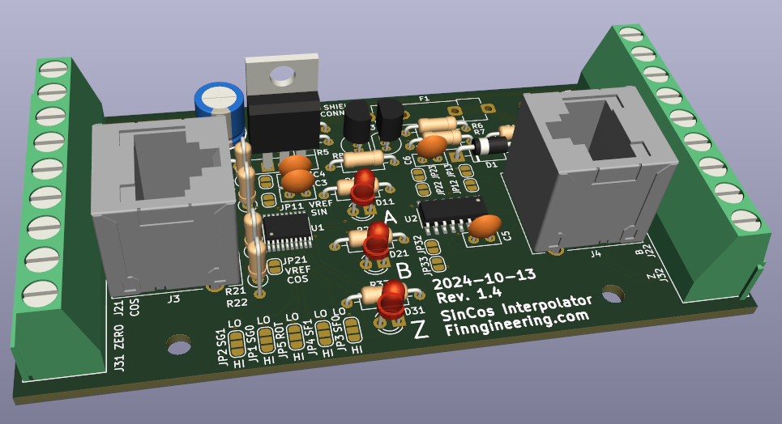

# SinCos Interpolator
The SinCos Interpolator reads the analog signals from (e.g. Heidenhain) linear scales and converts them into digital quadrature signals. The design is based on the iC-NV chip by iC-Haus. This board performs essentially the same function as Heidenhain "EXE" converters. The design was created for Heidenhain LS 403 linear scales with 11 uA peak-to-peak signals. Through different component values and solder jumper configuration, it should be usable also for other linear scales and similar transducers.

## Disclaimer
As of 2023-08-19, I have done preliminary tests on version 1.0 design and it appears to be working as expected. The version 1.1 design currently found here is yet untested. The main changes from version 1.0 is that RJ45 jacks are available for both input and output signals.

## Features
- Converts analog sine/cosine signals into digital quadrature outputs
- Interpolation factor selectable by solder jumpers
- Suitable for different type of input signals by resistor selection and solder jumper configuration
- Single ended or differential outputs (the latter with additional MC3487DX IC)
- Support for index/reference signal
- Normal screw terminal blocks with 5.08 mm raster for connections
- Optionally shielded RJ45 connectors for inputs and/or outputs
- Reverse polarity protection
- Overvoltage protection through crowbar circuit
- Using mainly through hole component for ease of soldering
- Two layer board with components on top side only

## Using with 11 uA peak-to-peak transducers (e.g. LS 403)

By component values and solder jumper configuration, the board can be adapted to different type of transducers. For 11 uA peak-to-peak transducers, resistors R1-R4 should have a 25 kOhm resistance and VREF jumpers JP6 and JP7 should be shorted by soldering. Jumper JP2/SG1 should be soldered "LO" (circuit ground) and JP1/SG0 should be left open to allow signal amplitues of up to 1 Vpp. Jumper JP5/ROT can be soldered "LO" unless some specific phase behaviour is required. Jumpers JP4/SF1 and JP3/SF0 are both left open for an interpolation factor of 5. With the 20 um periodicity of the LS 402 linear scales, this gives an output resolution of 1 um (provided the flanks of the A/B signals are "counted"). However, the iC-NV datasheet is not exceptionally clear, and you may want to do you own interpretation.

Single ended or differential outputs are selected by jumpers JP9-JP14. In the open state, differential outputs are used, which also requires the board to be populated with the MC3487DX IC. In case single ended signals are preferred, the MC3487DX is left out and jumpers JP9-JP14 are soldered short. This connects the output from the iC-NV directly to the "positive" output signal terminals and the "negative" signal terminals are tied to ground.
